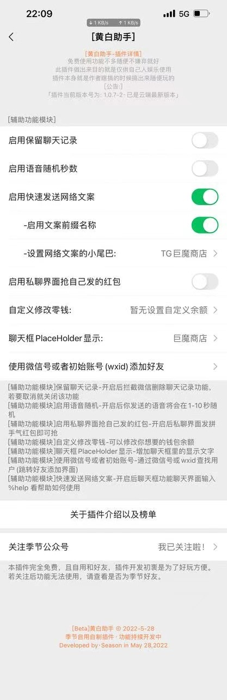
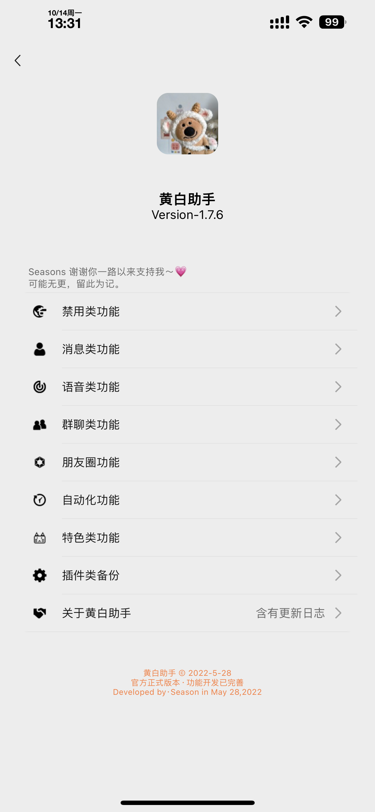

# HBWechatHelper
暂未开源，暂待整理后

微信黄白助手插件(开发始于 2022-05-28 实际发布版本1.0.7-2 ---->于 2023-03-17)

功能如下可见底下附图 >>该项目集成 SSZipArchive | FFmpeg | SilkSDK

待优化后考虑一切因素的情况下才会分享出来学习与探讨iOS逆向的技术

### 部分功能最低支持的微信版本[8.0.29] 
>特色玩法功能
>>多开过面容识别
>>>朋友圈管理功能
>>>>自动化操作功能
>>>>>禁用微信部分功能
>>>>>>增强微信消息功能
>>>>>>>增强语音玩法功能
>>>>>>>>群聊消息管理功能

(点歌朋友圈一键点赞，禁用控件，设置布局大小，私聊发抢自己的红包，文本转语音，文案语录，群聊管理，朋友圈保存实况 Live 图，消息防撤回，艾特所有人，朋友圈自定义选取位置，消息双击复读，修改气泡，修改按钮图标，修改显示微信号，自动呼出键盘，微信运动一键点赞，头像转发好友，强制下载 dylib 文件，设置全局圆头像，百变消息小尾巴，朋友圈小尾巴，等诸多功能)

|  初始版本  | 现在版本 |
| --- | --- |
|  | |

### 构建教程(未完成待整理)
<环境安装教程>
<编写插件教程>
<编译插件教程>
<上机测试插件>

### 鸣谢：
 该客户端项目一路走来都是自己看B站学习开发插件自己使用Flex-List琢磨功能一步一步的慢慢开发起来的，其中服务端(文本转语音等网络服务)是由huami一手创建，也经过不少用户支持我，给我打赏和赞助，其中遇到了不少问题，我也去请教过lanmao，感谢他无私奉献的精神，让我一步一步的努力成就了这个插件，一路走来都是挺不容易的，现在的开发环境也心酸我也不再愿意继续开发下去也已心累，我的兴趣可能也到此为止了吧。可能也不在继续开发了，等把其他事情完成把黄白助手项目整备好就进行开源，希望开源后能有其他开发者把功能集成在一起，满足大家的心愿，自从开发了这个插件，我感悟到了只要足够认真去想完成一件事，不管这个事有多难,我总是会不舍昼夜的去把这一件事情完成。
 
该微信插件构建过程中使用了开源插件项目里的代码以及环境
>[MonkeyDev](https://github.com/AloneMonkey/MonkeyDev)   
>[DKWechatHelper](https://github.com/DKJone/DKWechatHelper) 
